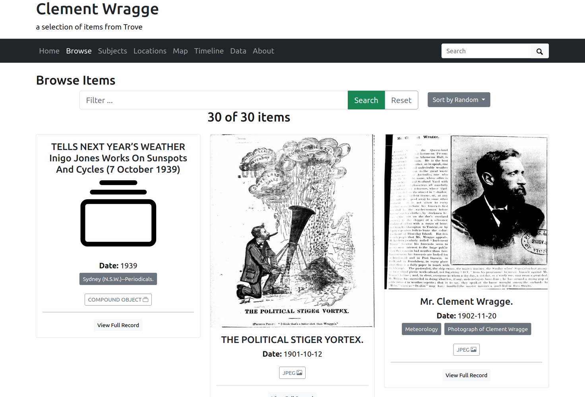

---
jupytext:
  text_representation:
    extension: .md
    format_name: myst
    format_version: 0.13
    jupytext_version: 1.16.1
kernelspec:
  display_name: Python 3 (ipykernel)
  language: python
  name: python3
---

# Sharing a Trove List as a CollectionBuilder exhibition

You've been collecting and annotating items relating to your research project in a Trove List. You'd like to display the contents of your list as an online exhibition for others to explore. [CollectionBuilder](https://collectionbuilder.github.io/) creates online exhibitions using static web technologies. But how do you get your List data from Trove into CollectionBuilder?



+++

## Tools

`````{grid}
:gutter: 3

````{grid-item-card} Convert a Trove list into a CollectionBuilder exhibition
:columns: 4


This notebook converts Trove lists into a series of files that can be uploaded to a CollectionBuilder-GH repository to create an instant exhibition. 

+++
```{button-link} https://glam-workbench.net/trove-lists/convert-list-to-cb-exhibition/
:color: primary
More info
```
````

````{grid-item-card} CollectionBuilder
:columns: 4


CollectionBuilder is an open source framework for creating digital collection and exhibit websites that are driven by metadata and powered by modern static web technology.

+++
```{button-link} https://collectionbuilder.github.io/
:color: primary
More info
```
````
`````

+++

## Trove Lists

Creating

Adding notes and tags -- some basic html in notes

(Option in notebook to filter tags by user?? Nope usernames not included just dates)

+++

## Preparing your list data for CollectionBuilder

To create your CollectionBuilder exhibition you need a metadata file containing details of all the items in the exhibition, as well as any images associated with the items. The [Convert a Trove list into a CollectionBuilder exhibition](https://glam-workbench.net/trove-lists/convert-list-to-cb-exhibition/) assembles all the necessary information from Trove and formats it ready for upload.

The notebook has three main outputs:

- a `_config.yml` file that configures various CollectionBuilder settings such as the title of your exhibition and the source of the metadata
- a CSV formatted metadata file that contains details of each individial item in your list
- a directory of images relating to the items

The Trove API provides basic details of all the items in a list, but to take advantage of CollectionBuilder's visualisation options the notebook tries to enrich the API data by retrieving some additional information. For example:

- user added notes are saved into the `description` field
- user added tags are combined with subject headings in the `subject` field
- place names identified using the Library of Congress's GeographicArea codes are converted to human-readable labels
- an attempt is made to find values for `latitude` and `longitude` – if the item is a digitised map from the NLA collection, the notebook looks for coordinates in the MARC data embedded in the digitised map viewer; otherwise if places are identified using the Library of Congress's GeographicArea codes, the coordinates are retrieved using [this dataset](https://github.com/GLAM-Workbench/marc-geographicareas)
- if an item is associated with multiple images (such as a newspaper or periodical article) the notebook creates a parent record and saves each image in a separate child row – these are displayed as 'compound objects' in CollectionBuilder

Similarly, the notebook assembles images from a number of different sources:

- images of newspaper articles are downloaded using the [trove-newspaper-images](https://wragge.github.io/trove_newspaper_images/) Python package
- images from other digitised NLA collections are [downloaded from the digitised item viewer](digitised:data:image-urls) – for periodical articles, this means using the metadata embedded in the digitised journal viewer to [find links to the pages](digitised:howto:embedded-metadata:articles) on which the article appears
- if the items are from other collections, the notebook first looks for a `viewcopy` link to download a digised image, if this isn't available it uses a `thumbnail` link


### Running the notebook

Go to [Convert a Trove list into a CollectionBuilder exhibition](https://glam-workbench.net/trove-lists/convert-list-to-cb-exhibition/) in the Trove images section of the GLAM Workbench.

This notebook, like all GLAM Workbench notebooks, needs to be run in a customised computing environment. The easiest way to do this is through BinderHub. BinderHub is a cloud-based service that gets a notebook up and running by reading its requirements from a code repository, and creating an environment with the necessary software. The GLAM Workbench is integrated with two BinderHub services:

- [ARDC Binder](https://ardc.edu.au/services/ardc-nectar-research-cloud/ardc-binderhub-service/) – based in Australia, requires login using university credentials
- [MyBinder](https://mybinder.org/) – international, no login required

If you have a login at an Australian university or research agency, try the ARDC Binder service first. It's a little more effort, but it's usually faster and more reliable than the public MyBinder service which can have capacity issues.

The GLAM Workbench displays a preview of the notebook, with options to run it using either the ARDC Binder or MyBinder service.

```{figure} ../../images/gw-iiif-nb.png
:width: 600px
:name: gw-iiif-nb

The GLAM Workbench provides a number of ways you can run the notebook.
```

#### Using ARDC Binder

To use the ARDC Binder service, click on the ARDC Binder tab under the notebook preview. You should see a big, blue **Run live on ARDC Binder** button. Click on the button to launch the Binder service.

If this is the first time you've used the ARDC Binder service you'll be asked to login using the Australian Access Federation (AAF).

```{figure} ../../images/ardc-binder-aaf-login.png
:width: 600px
:name: gw-iiif-nb

ARDC Binder will ask you to log in using AAF
```

Click on the **Sign in with AAF/Tuakiri** button. You'll be asked to select either AAF or Tuakiri – select AAF.

To sign in with AAF, select your institution from the list, then click the **Continue to your organisation** button.

```{figure} ../../images/aaf-institutions-select.png
:width: 300px
:name: aaf-institutions-select

Select your institution from the AAF list
```

You'll be redirected to your insitution's login screen. Log in using your usual credentials. Once you've logged in you'll be redirected back to ARDC Binder and the notebook will start to load. You might have to wait a bit while a customised computing environment is prepared for you. If you see a message saying that things are taking a long time and there might be a problem, just ignore it. Eventually the notebook will load in the Jupyter Lab interface.

#### Using MyBinder

```{figure} ../../images/mybinder-tab.png
:width: 600px
:name: mybinder-tab

Click on the MyBinder tab.
```

To use the MyBinder service, click on the MyBinder tab under the notebook preview. You should see a big, blue **Run live on MyBinder** button. Click on the button to launch the Binder service. No login is required, so MyBinder immediately starts building a customised computing environment. This can take a while, but eventually the notebook should load in the Jupyter Lab interface.

### Using the notebook in Jupyter Lab

No matter what service you use to run the notebook, the result will be the same – the notebook will open in the Jupyter Lab interface.

```{figure} ../../images/iiif-nb-jupyterlab.png
:width: 600px
:name: iiif-nb-jupyterlab

The notebook running in Jupyter Lab.
```

### Converting your list

+++

## Enriching your data

- places
- images

+++

## Preparing your CollectionBuilder repository

- use template
- enable GH Pages

+++

## Uploading your data to CollectionBuilder

+++

## Next steps
