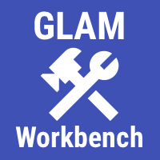

---
jupytext:
  text_representation:
    extension: .md
    format_name: myst
    format_version: 0.13
    jupytext_version: 1.16.1
kernelspec:
  display_name: Python 3 (ipykernel)
  language: python
  name: python3
---

+++ {"editable": true, "slideshow": {"slide_type": ""}}

# Sharing a Trove List as a CollectionBuilder exhibition

You've been collecting and annotating items relating to your research project in a Trove List. You'd like to display the contents of your list as an online exhibition for others to explore. [CollectionBuilder](https://collectionbuilder.github.io/) creates online exhibitions using static web technologies. But how do you get your List data from Trove into CollectionBuilder?

```{figure} ../../images/cb-wragge-demo.png
:name: cb-wragge-demo

Here's an example: [this exhibition](https://wragge.github.io/cb-wragge/) has been generated from [this list](https://trove.nla.gov.au/list/83777).
```

```{contents}
:local:
:backlinks: None
```

+++

## Tools

`````{grid}
:gutter: 3

````{grid-item-card} Convert a Trove list into a CollectionBuilder exhibition
:columns: 6



This notebook converts Trove lists into a series of files that can be uploaded to a CollectionBuilder-GH repository to create an instant exhibition. 

+++
```{button-link} https://glam-workbench.net/trove-lists/convert-list-to-cb-exhibition/
:color: primary
More info
```
````

````{grid-item-card} CollectionBuilder
:columns: 6


CollectionBuilder is an open source framework for creating digital collection and exhibit websites that are driven by metadata and powered by modern static web technology.

+++
```{button-link} https://collectionbuilder.github.io/
:color: primary
More info
```
````
`````

+++

## What you need

- a [Trove API key](pathways:collections:cb:api-key)
- a [GitHub account](https://docs.github.com/en/get-started/start-your-journey/creating-an-account-on-github)
- a [Trove List](pathways:collections:cb:lists) containing items you want to include in your exhibition

(pathways:collections:cb:api-key)=
## Getting your own Trove API key

The [Convert a Trove list into a CollectionBuilder exhibition](https://glam-workbench.net/trove-lists/convert-list-to-cb-exhibition/) notebook downloads data using Trove's Application Programming Interface (API). Access to the API is managed through the use of 'keys'. You'll need your own API key to use the notebook. Fortunately, it's quick and easy to get a key for non-commercial use. See Trove's [Using the API](https://trove.nla.gov.au/about/create-something/using-api) help page for full details, but in summary you need to:

- [create a Trove user account](https://trove.nla.gov.au/help/your-trove-account/creating-account) (if you don't have one already)
- login to your user account and go to your profile
- click on the 'For developers' tab
- fill in and submit the API application form

```{warning}
Your API key will be displayed as soon as you submit the application form, however, it can take several minutes for the key to be activated. If you receive authentication errors when you try to use the key, wait a little while and then try again.
```
Your API key is just a string of random letters and numbers. Any time you need it, just go back to the 'For developers' tab in your user profile and copy the key from the page.

```{figure} ../../images/trove-user-api-tab.png
:width: 600px
:name: trove-user-api-tab

Your API will be displayed in the 'For developers' tab of your user profile.
```

(pathways:collections:cb:lists)=
## Using Trove Lists

Trove's List function provides a convenient way of assembling collections of resources. You can create a list to organise your research on a particular topic, adding relevant newspaper and gazette articles, as well as work records from other Trove categories. See the Trove help documentation for [information on creating and using lists](https://trove.nla.gov.au/help/become-voluntrove/lists).

```{figure} ../../images/lists-cb-list-example.png
:width: 600px
:name: lists-cb-list-example

An example of a list, <https://trove.nla.gov.au/list/83777>
```

### Adding notes and tags to items

You can annotate items in your Trove lists by adding notes. You can do this when you first add an item to a list by filling in the 'Reason for adding this item' field. Or you can add notes later by clicking on the **Add list item note** button from the list interface.

```{figure} ../../images/lists-cb-add-note.png
:width: 400px
:name: lists-add-note

Click on the **Add list item note** button to annotate an item.
```

One undocumented feature of these notes is that they support basic HTML tags like `<p></p>` (for paragraphs), `<b></b>` (for **bold**), and `<i></i>` for italics. Links, however, will be removed. This means you can apply some simple formatting to your notes.

These notes will be saved in the `description` field of your CollectionBuilder metadata, and displayed (with any HTML formatting) on the item's page in the final exhibition.

Any tags attached to items will be added to the `subject` field in the CollectionBuilder metadata and used to create a word cloud visualisation in the exhibition interface. See the Trove help documentation for [information on adding tags](https://trove.nla.gov.au/help/become-voluntrove/tags).

### Make sure your list is set to **public**

Trove lists can be made 'public' or 'private'. However, **your list needs to be 'public'** if you want to access data for upload to CollectionBuilder. To check if your list is public, go to the list and look for 'Public List' label.

```{figure} ../../images/lists-cb-public.png
:width: 400px
:name: lists-cb-public

Check that your list is set to 'public'.
```

To change the setting from 'private' to 'public'. Log into your Trove user account, then go to the list. Click on the 'Manage this list' link. Click on the 'public' radio button, then click **Save**.

```{figure} ../../images/lists-cb-public-change.png
:width: 500px
:name: lists-cb-public-change

Click on the 'public' radio button.
```

```{warning}
If your list isn't set to 'public' the steps below will fail in unpleasant ways! Check now and adjust if necessary.
```

### Getting your list identifier

To download data from your list using the [Convert a Trove list into a CollectionBuilder exhibition](https://glam-workbench.net/trove-lists/convert-list-to-cb-exhibition/) notebook, you need the list's numeric identifier. The identifier is the number in the url of your Trove list. For example, if your list has the url `https://trove.nla.gov.au/list/83774` then the identifier is `83774`. As described below, you'll need to copy and paste the list identifier into the notebook.

+++

## Preparing your list data for CollectionBuilder

To create your CollectionBuilder exhibition you need a metadata file containing details of all the items in the exhibition, as well as any images associated with the items. The [Convert a Trove list into a CollectionBuilder exhibition](https://glam-workbench.net/trove-lists/convert-list-to-cb-exhibition/) notebook assembles all the necessary information from Trove and formats it ready for upload.

As well as allowing you to search and browse the items in your exhibition, CollectionBuilder uses the item metadata to create a series of visualisations:

- the `subject` field is used to create a word cloud of subject headings and tags
- the `location` field is used to create a word cloud of related places
- the `latitude` and `longitude` fields are used to position items on a map
- the `date` field is used to create a timeline

```{figure} ../../images/lists-cb-timeline.png
:width: 600px
:name: lists-cb-timeline

Example of CollectionBuilder's timeline visualisation.
```

The Trove API provides basic details of all the items in a list, but to take advantage of CollectionBuilder's visualisation options the notebook tries to enrich the API data by retrieving some additional information. For example:

- user added notes are saved into the `description` field
- user added tags are combined with subject headings in the `subject` field
- place names identified using the Library of Congress's GeographicArea codes are converted to human-readable labels and added to the `location` field
- an attempt is made to find values for `latitude` and `longitude` – if the item is a digitised map from the NLA collection, the notebook looks for coordinates in the MARC data embedded in the digitised map viewer; otherwise if places are identified using the Library of Congress's GeographicArea codes, the coordinates are retrieved using [this dataset](https://github.com/GLAM-Workbench/marc-geographicareas)
- if an item is associated with multiple images (such as a newspaper or periodical article) the notebook creates a parent record and saves each image in a separate child row – these are displayed as 'compound objects' in CollectionBuilder

Similarly, the notebook assembles images from a number of different sources:

- images of newspaper articles are downloaded using the [trove-newspaper-images](https://wragge.github.io/trove_newspaper_images/) Python package
- images from other digitised NLA collections are [downloaded from the digitised item viewer](digitised:data:image-urls) – for periodical articles, this means using the metadata embedded in the digitised journal viewer to [find links to the pages](digitised:howto:embedded-metadata:articles) on which the article appears
- if the items are from other collections, the notebook first looks for a `viewcopy` link to download a digised image, if this isn't available it uses a `thumbnail` link

### Running the notebook

Go to [Convert a Trove list into a CollectionBuilder exhibition](https://glam-workbench.net/trove-lists/convert-list-to-cb-exhibition/) in the Trove images section of the GLAM Workbench.

This notebook, like all GLAM Workbench notebooks, needs to be run in a customised computing environment. The easiest way to do this is through BinderHub. BinderHub is a cloud-based service that gets a notebook up and running by reading its requirements from a code repository, and creating an environment with the necessary software. The GLAM Workbench is integrated with two BinderHub services:

- [ARDC Binder](https://ardc.edu.au/services/ardc-nectar-research-cloud/ardc-binderhub-service/) – based in Australia, requires login using university credentials
- [MyBinder](https://mybinder.org/) – international, no login required

If you have a login at an Australian university or research agency, try the ARDC Binder service first. It's a little more effort, but it's usually faster and more reliable than the public MyBinder service which can have capacity issues.

The GLAM Workbench displays a preview of the notebook, with options to run it using either the ARDC Binder or MyBinder service.

```{figure} ../../images/lists-cb-gw.png
:width: 600px
:name: lists-cb-gw

The GLAM Workbench provides a number of ways you can run the notebook.
```

#### Using ARDC Binder

To use the ARDC Binder service, click on the ARDC Binder tab under the notebook preview. You should see a big, blue **Run live on ARDC Binder** button. Click on the button to launch the Binder service.

If this is the first time you've used the ARDC Binder service you'll be asked to login using the Australian Access Federation (AAF).

```{figure} ../../images/ardc-binder-aaf-login.png
:width: 600px
:name: gw-iiif-nb

ARDC Binder will ask you to log in using AAF
```

Click on the **Sign in with AAF/Tuakiri** button. You'll be asked to select either AAF or Tuakiri – select AAF.

To sign in with AAF, select your institution from the list, then click the **Continue to your organisation** button.

```{figure} ../../images/aaf-institutions-select.png
:width: 300px
:name: aaf-institutions-select

Select your institution from the AAF list
```

You'll be redirected to your insitution's login screen. Log in using your usual credentials. Once you've logged in you'll be redirected back to ARDC Binder and the notebook will start to load. You might have to wait a bit while a customised computing environment is prepared for you. If you see a message saying that things are taking a long time and there might be a problem, just ignore it. Eventually the notebook will load in the Jupyter Lab interface.

#### Using MyBinder

```{figure} ../../images/mybinder-tab.png
:width: 600px
:name: mybinder-tab

Click on the MyBinder tab.
```

To use the MyBinder service, click on the MyBinder tab under the notebook preview. You should see a big, blue **Run live on MyBinder** button. Click on the button to launch the Binder service. No login is required, so MyBinder immediately starts building a customised computing environment. This can take a while, but eventually the notebook should load in the Jupyter Lab interface.

### Using the notebook in Jupyter Lab

No matter what service you use to run the notebook, the result will be the same – the notebook will open in the Jupyter Lab interface.

```{figure} ../../images/lists-cb-nb.png
:width: 600px
:name: lists-cb-nb

The notebook running in Jupyter Lab.
```

Scroll down the notebook until you reach the section headed 'Add your API key and list ID values'. There are two cells in this section that you need to edit:

- click on the first cell to activate it, then paste your Trove API key between the quotes where indicated
- click on the next cell to activate it, then paste your list identifier between the quotes where indicated 

```{figure} ../../images/lists-cb-add-details.png
:width: 600px
:name: lists-cb-add-details

Paste your API key and list identifier where indicated
```

Now you're ready to generate your CollectionBuilder files! From the 'Run' menu select 'Run All Cells'.

```{figure} ../../images/lists-cb-run-cells.png
:width: 400px
:name: lists-cb-run-cells

Select 'Run' > 'Run All Cells' from the JupyterLab menu
```

Scroll further down the notebook until you reach the section headed 'Let's do it!'. Below the cell in this section you should see a progress bar that shows you how many list items have been processed. 

```{admonition} Be patient!
:class: warning
Processing all the items in a list can be slow, particularly if your list includes a lot of newspaper articles. This is because the notebook attempts to download an image of every article. There's no built-in mechanism for this, so the notebook uses the [trove-newspaper-images](https://wragge.github.io/trove_newspaper_images/) package to crop articles from high-resolution page images. This usually works, but recently I've noticed some errors from Trove. The notebook makes a couple of attempts if errors are detected. 
```

When the notebook has finished processing your list, the progress bar will turn green and a download link will appear under 'Download your results'.

```{figure} ../../images/lists-cb-download.png
:width: 600px
:name: lists-cb-run-download

Processing has finished! Click on the link to download your files.
```

Click on the 'Download you files' link to download a zip file containing all the metadata and images for your CollectionBuilder exhibition.

+++

## Examining your files

Unzip the file you downloaded from the notebook and have a look inside. You should see two directories, `_data` and `objects`, and a `_config.yml` file. The file and directory names are the same as those used by CollectionBuilder.

```{figure} ../../images/lists-cb-files.png
:width: 400px
:name: lists-cb-run-files

View the contents of the zip file.
```

- the `_config.yml` file configures various CollectionBuilder settings such as the title of your exhibition and the source of the metadata
- the `objects` directory will contain all the images downloaded from items in your list
- the `_data` directory will contain the item metadata in a CSV file named according to your list identifier – for example, if your list identifier is `83777`, your metadata file will be named `83777-items.csv`

+++ {"editable": true, "slideshow": {"slide_type": ""}}

## Preparing your CollectionBuilder repository

Now that the data is ready, you can set up the CollectionBuilder repository.

There are three different flavours of CollectionBuilder. This tutorial uses the GitHub Pages template, which is quick and doesn't require you to install any software. The CollectionBuilder site provides more detailed documentation about [CollectionBuilder-GH ](https://collectionbuilder.github.io/cb-docs/docs/walkthroughs/gh-walkthrough/).

If you don't have one already, you'll need [to create a GitHub user account](https://docs.github.com/en/get-started/start-your-journey/creating-an-account-on-github) – the standard free, personal account is fine. Log into your account before proceeding.

Go to the [collectionbuilder-gh-trove](https://github.com/wragge/collectionbuilder-gh-trove) GitHub repository. Click on the **Use this template** button and select 'Create a new repository'.

```{figure} ../../images/lists-cb-repo.png
:width: 600px
:name: lists-cb-repo

Click on the **Use this template** button.
```

Enter a name for your repository in the 'Repository name' field. This name will be used in the url of your exhibition, so you might want to use something related to the content of your list.

```{figure} ../../images/lists-cb-repo-new.png
:width: 400px
:name: lists-cb-repo-new

Give your repository a name.
```

Your new repository will now be generated using the CollectionBuilder template. Once it loads, click on the 'Settings' tab and select 'Pages' from the left hand menu. In the **Branch** section, select `main` from the 'Select branch' dropdown list. Click **Save**.

```{figure} ../../images/lists-cb-set-pages.png
:width: 600px
:name: lists-cb-set-pages

Set the 'Pages' branch to 'main' and save.
```

GitHub will now build the default CollectionBuilder exhibition and publish it online. The exhibition url will have the form: 

`https://[your GH user name].github.io/[your repository name]`. 

You can find the url by clicking on the 'Deployments' link from the repository home page.

```{figure} ../../images/lists-cb-deployments.png
:width: 600px
:name: lists-cb-deployment

The exhibition url will be displayed on the 'Deployments' page.
```

At the moment the exhibition will just contain demo data – the next step is to add the data from your Trove list!

+++

## Uploading your data to CollectionBuilder

To add your Trove list data to your CollectionBuilder repository and build your new exhibition, you have to:

- upload the `_config.yml` to the parent directory
- upload your metadata CSV file to the `_data` directory
- upload your images to the `objects` directory

From your repository's home page, click on the **Add file** button and select 'Upload files'.

```{figure} ../../images/lists-cb-upload-files.png
:width: 400px
:name: lists-cb-upload-files

Click on the **Add file** button and select 'Upload files'.
```

Select the `_config.yml` file you downloaded from the notebook. Once it has uploaded to GitHub, click on the **Commit changes** button.

```{figure} ../../images/lists-cb-commit-files.png
:width: 600px
:name: lists-cb-commit-files

Upload files then click on the **Commit changes** button.
```

Double click on the repository's `data` directory to open it. Then repeat the process above to upload and commit your exhibition's CSV metadata file. You'll find it in the `data` directory of the files you downloaded from the notebook.

```{figure} ../../images/lists-cb-data-dir.png
:width: 600px
:name: lists-cb-data-dir

Upload files to the `data` and `objects` directories.
```

Finally, double click on the repository's `objects` directory and upload and commit all of the image files for your exhibition. The images will be inside the `objects` directory of the files you downloaded from the notebook. You can select and upload multiple files at once.

GitHub will now rebuild the exhibition using your new data.

Reload the exhibition url to see your brand new Trove exhibition!

+++

## Going further (optional)

### Enriching your metadata

The [Convert a Trove list into a CollectionBuilder exhibition](https://glam-workbench.net/trove-lists/convert-list-to-cb-exhibition/) notebook does what it can to get useful metadata out of Trove, but sometime the information's just not there. For example, there may be images or articles relating to a particular place that don't have any spatial metadata. You can add this sort of information to your exhibition by manually editing the metadata CSV file.

Information about places is contained in three columns: `location`, `latitude`, and `longitude`. In the location field you can include a list of place names, separated by semicolons, eg: 'Melbourne; Sydney; Hobart'. These placenames will be used to build a word cloud when you click on the 'Location' tab in your exhibition. To add an item to CollectionBuilder's map view, you need to supply values for `latitude` and `longitude`. You might also want to edit the subject, and description fields.

To edit your exhibition metadata:

- open your metadata file with either a text editor or a spreadsheet program (but beware that some programs like Excel, might mangle your dates)
- edit the desired values
- make sure the edited file is saved in CSV (plain text) format, replacing the original metadata file
- upload the edited file to your repository

```{tip}
GitHub has it's own built-in file editor. If you're viewing the metadata file in GitHub just click on the pencil icon to edit. Once you've finished editing, make sure you click the Commit button to save your changes.
```

### Replace tiny images

Trove aggregated work records often only include links to tiny thumbnailed versions of images. These don't look great in an exhibition, so you might want to replace them. Different collections use different image viewers, so there's no easy, automated way to do this. You'll have to manually download them and replace the thumnailed versions.

- from the Trove work record, click on the **View** button and open the link to the original item
- use whatever download mechanism is provided to save a copy of the image on your computer
- rename the downloaded image to match the name of the tiny thumbnailed version in your exhibition's `objects` directory
- replace the thumbnail image in the `objects` directory with the new downloaded version

### Edit the theme

You can further customise the look and feel of your exhibition by editing the `_data/theme.yml` file. For example, you can:

* Set a different `featured-image` to display in the header of your exhibition.
* Change the `latitude` and `longitude` values to set the centre on the map view.

See the [CollectionBuilder documentation](https://collectionbuilder.github.io/cb-docs/docs/theme/) for more options.

### Enhancing your exhibition

The CollectionBuilder site describes the GitHub Pages template as 'great option for learning, teaching, quick prototyping, or just testing'. But if you want to develop your exhibition further, it suggests using the [CollectionBuilder-CSV](https://collectionbuilder.github.io/csv/) approach, which is more 'robust, flexible, and customizable'. There's a detailed tutorial describing how you can [convert your exhibition from Pages to CSV](https://collectionbuilder.github.io/cb-docs/docs/walkthroughs/transfer-walkthrough/). The CSV approach goes beyond the limitations of GitHub Pages and enhances the display of your items, but it's more technically advanced and requires the installation of software on your local computer.
