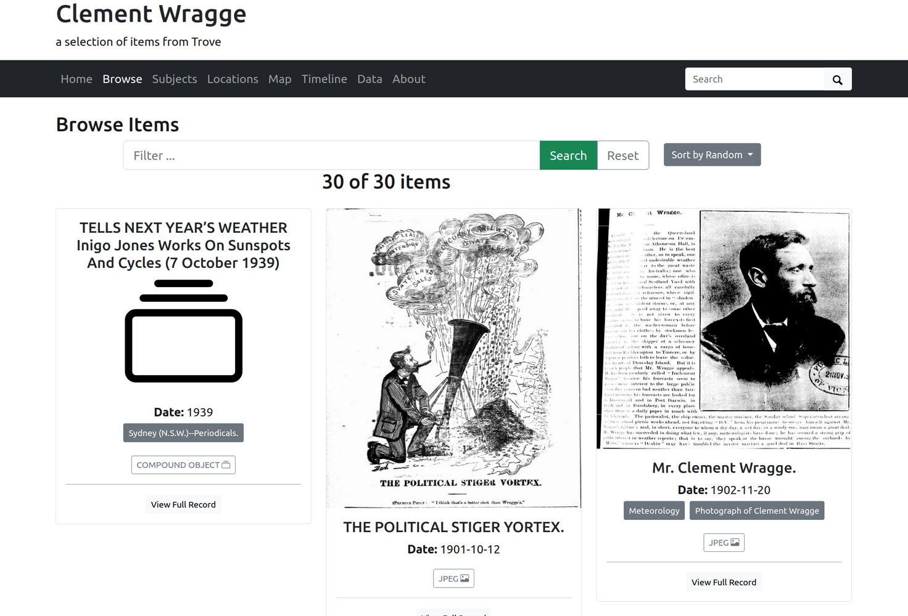

---
jupytext:
  text_representation:
    extension: .md
    format_name: myst
    format_version: 0.13
    jupytext_version: 1.16.1
kernelspec:
  display_name: Python 3 (ipykernel)
  language: python
  name: python3
---

+++ {"editable": true, "slideshow": {"slide_type": ""}}

# Tutorials and examples

````{card}
This page includes information on tutorials and examples to help you create and share your own collections or resources from Trove.

```{contents}
:local:
:backlinks: None
```
````

## Tutorials

`````{grid}
:gutter: 3

````{grid-item-card} Sharing a Trove List as a CollectionBuilder exhibition
:columns: 6



You've been collecting and annotating items relating to your research project in a Trove List. You'd like to display the contents of your list as an online exhibition for others to explore. [CollectionBuilder](https://collectionbuilder.github.io/) creates online exhibitions using static web technologies. But how do you get your List data from Trove into CollectionBuilder?

+++
```{button-link} collectionbuilder.html
:color: primary
Get started
```
````
`````

+++ {"editable": true, "slideshow": {"slide_type": ""}}

## Examples from the GLAM Workbench

[Convert a Trove list into a CSV file](https://glam-workbench.net/trove-lists/convert-a-trove-list-into-a-csv-file/)
: This notebook converts Trove lists into CSV files (spreadsheets). Separate CSV files are created for newspaper articles and works from Trove's other zones. You can also save the OCRd text, a PDF, and an image of each newspaper article.

[Convert a Trove list into a CollectionBuilder exhibition](https://glam-workbench.net/trove-lists/convert-list-to-cb-exhibition/)
: This notebook converts Trove lists into CSV files (spreadsheets). Separate CSV files are created for newspaper articles and works from Trove's other zones. You can also save the OCRd text, a PDF, and an image of each newspaper article.

[Upload Trove newspaper articles to Omeka-S](https://glam-workbench.net/trove-newspapers/Upload-Trove-newspapers-to-Omeka/)
: This notebook steps through the process of uploading Trove newspaper articles to your own Omeka-S instance via the API. As well as uploading the article metadata, it attaches image(s) and PDFs of the articles, and creates a linked record for the publishing newspaper. The source of the articles can be a Trove search, a Trove list, a Zotero collection, or just a list of article ids.

[Display the results of a Trove newspaper harvest as a searchable database using Datasette](https://glam-workbench.net/trove-harvester/display-harvest-results-in-datasette/)
: This notebook shows you how to load the newspaper data you've harvested into Datasette, and start it up. If you've also harvested full-text and images from the newspaper articles, you can add these to your database as well!

```{code-cell} ipython3

```
