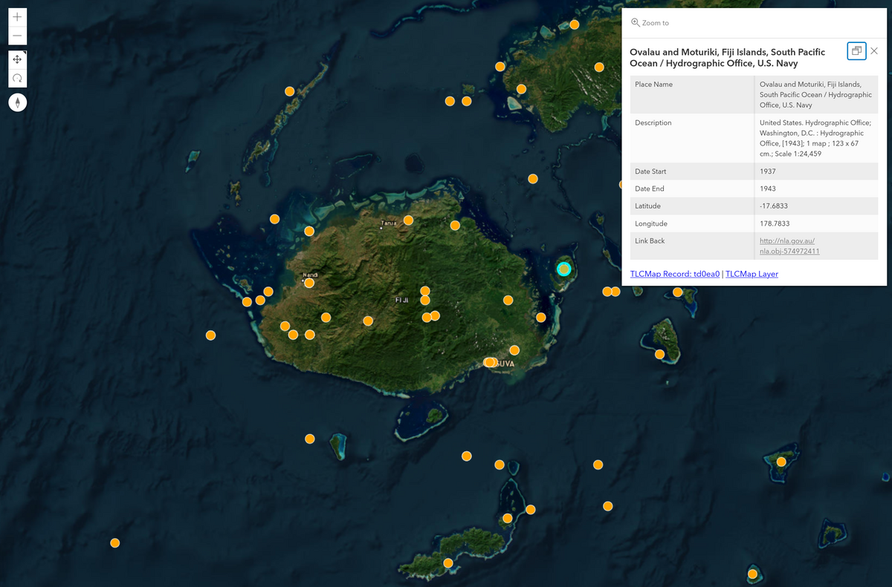

---
jupytext:
  text_representation:
    extension: .md
    format_name: myst
    format_version: 0.13
    jupytext_version: 1.16.1
kernelspec:
  display_name: Python 3 (ipykernel)
  language: python
  name: python3
---

# Tutorials and examples

````{card}
This page includes information on tutorials and examples to help you work with maps and place data from Trove.

```{contents}
:local:
:backlinks: None
```
````

+++

## Tutorials

`````{grid}
:gutter: 3

````{grid-item-card} Create a layer in the Gazetteer of Historical Australian Placenames using metadata from Trove’s digitised maps
:columns: 6



Trove includes thousands of digitised maps, created and published across the last few centuries. You want to create a collection of maps relating to your area of interest and explore it using the Gazetteer of Historical Australian Placenames (GHAP). You know it's possible to add layers to GHAP, but how do you get the data from Trove in a format that can be uploaded as a layer?

+++
```{button-link} maps-to-ghap.html
:color: primary
Get started
```
````
`````

+++

## Examples from the GLAM Workbench

[Map Trove newspaper results by state](https://glam-workbench.net/trove-newspapers/Map-newspaper-results-by-state/)
: This notebook uses the Trove state facet to create a choropleth map that visualises the number of search results per state.

[Map Trove newspaper results by place of publication](https://glam-workbench.net/trove-newspapers/Map-newspaper-results-by-place-of-publication/)
: This notebook uses the Trove title facet to find the number of results per newspaper, then merges the results with a dataset of geolocated newspapers to map where articles were published.

[Map Trove newspaper results by place of publication over time](https://glam-workbench.net/trove-newspapers/Map-newspaper-results-by-place-of-publication-over-time/)
: This notebook uses the Trove title facet to find the number of results per newspaper, then merges the results with a dataset of geolocated newspapers to map where articles were published, and adds a time dimension to create an animated heatmap.

[Parse map coordinates from metadata](https://glam-workbench.net/trove-maps/parse-coordinates/)
: The harvest of digitised maps metadata includes a coordinates column that provides a string representation of either a point or a bounding box. This notebook attempts to parse the coordinate string and convert the values to decimals. It then uses the decimal values to explore the geographical context of Trove's digitised map collection.
