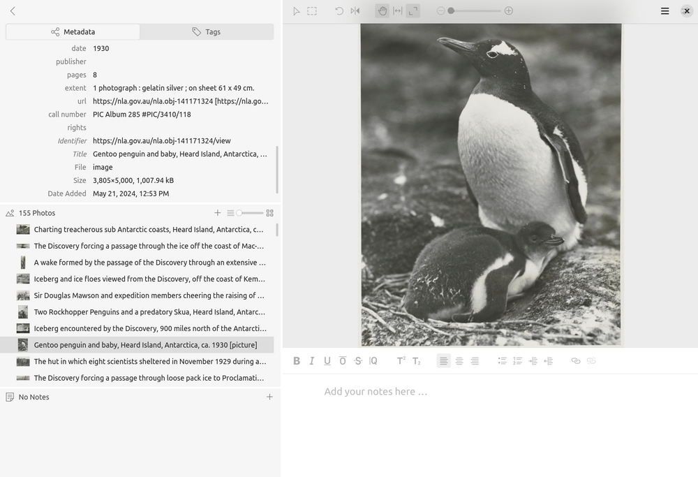

---
jupytext:
  text_representation:
    extension: .md
    format_name: myst
    format_version: 0.13
    jupytext_version: 1.16.1
kernelspec:
  display_name: Python 3 (ipykernel)
  language: python
  name: python3
---

# Tutorials and examples

````{card}
This page includes information on tutorials and examples to help you work with images from Trove.

```{contents}
:local:
:backlinks: None
```
````

+++

## Tutorials

`````{grid}
:gutter: 3

````{grid-item-card} Working with a Trove collection in Tropy
:columns: 6



You want to be able to work on a collection of digitised images from Trove on your desktop – adding notes, transcriptions, and annotations. [Tropy](https://tropy.org/) is a useful tool for managing collections of research images, but how do you import a collection of images from Trove into Tropy? This tutorial walks through one possible method.

+++
```{button-link} tropy.md
:color: primary
Get started
```
````

````{grid-item-card} Comparing manuscript collections in Mirador
:columns: 6


You want to compare the contents of two digitised manuscript collections and examine individual documents side-by-side. The [Mirador viewer](https://projectmirador.org/) can be configured as a flexible, research workspace that displays multiple images from different sources, but how do you get manuscript collections from Trove to Mirador?

+++
```{button-link} mirador.md
:color: primary
Get started
```
````
`````

+++

## Examples from the GLAM Workbench

[Save a collection of digitised images as an IIIF manifest](https://glam-workbench.net/trove-images/save-image-collection-iiif/)
: This notebook harvests metadata describing the contents of a digitised collection in Trove and saves it as an IIIF manifest.

[Make composite images from lots of Trove newspaper thumbnails](https://glam-workbench.net/trove-newspapers/Composite-thumbnails/)
: This notebook starts with a search in Trove's newspapers. It uses the Trove API to work its way through the search results. For each article it creates a thumbnail image using the code from this notebook. Once this first stage is finished, you have a directory full of lots of thumbnails. The next stage takes all those thumbnails and pastes them one by one into a BIG image to create a composite, or mosaic.

[Create 'scissors and paste' messages from Trove newspaper articles](https://glam-workbench.net/trove-newspapers/trove-newspapers-scissors-and-paste/)
: When you search for a term in Trove's digitised newspapers and click on individual article, you'll see your search terms are highlighted. If you look at the code you'll see the highlighted box around the word includes its page coordinates. That means that if we search for a word, we can find where it appears on a page, and by cropping the page to those coordinates we can create an image of an individual word. By combining these images we can create scissors and paste style messages!

[Create large composite images from snipped words](https://glam-workbench.net/trove-newspapers/trove-newspapers-create-composite-from-words/)
: This is a variation of the 'scissors & paste' notebook that extracts words from Trove newspaper images and compiles them into messages. In this notebook, you can harvest multiple versions of a list of words and compile them all into one big image.
