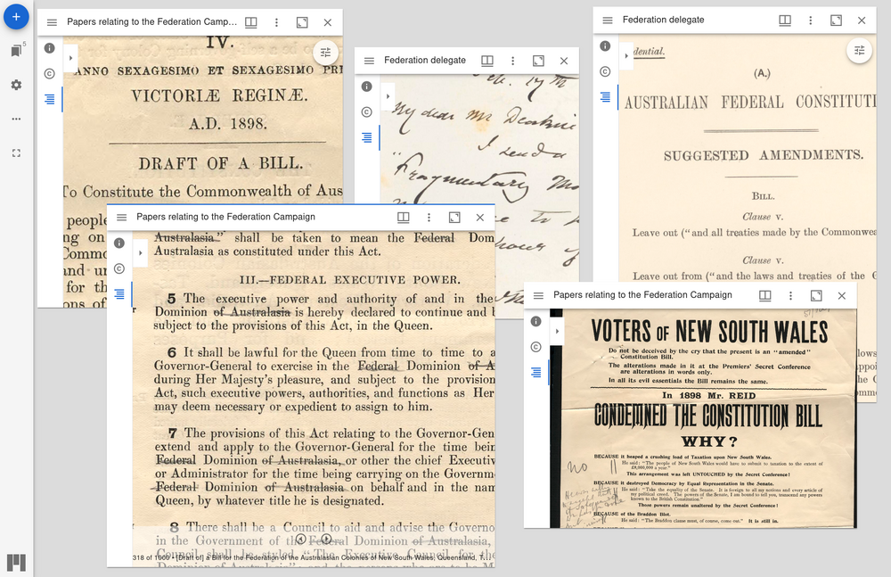

---
jupytext:
  text_representation:
    extension: .md
    format_name: myst
    format_version: 0.13
    jupytext_version: 1.16.1
kernelspec:
  display_name: Python 3 (ipykernel)
  language: python
  name: python3
---

# Comparing manuscript collections in Mirador

You want to compare the contents of two digitised manuscript collections and examine individual documents side-by-side. The [Mirador viewer](https://projectmirador.org/) can be configured as a flexible, research workspace that displays multiple images from different sources, but how do you get manuscript collections from Trove to Mirador?



````{card}
On this page:

```{contents}
:local:
:backlinks: None
```
````

+++

## Tools and standards

`````{grid}
:gutter: 3

````{grid-item-card} Save a collection of digitised images as an IIIF manifest
:columns: 4


This notebook harvests metadata describing the contents of a digitised collection in Trove and saves it as an IIIF manifest. This makes it possible to work with data from Trove in a variety of IIIF-compliant tools.

+++
```{button-link} https://glam-workbench.net/trove-images/save-image-collection-iiif/
:color: primary
More info
```
````

````{grid-item-card} IIIF
:columns: 4


IIIF is a set of open standards for delivering high-quality, attributed digital objects online at scale. 

+++
```{button-link} https://iiif.io/
:color: primary
More info
```
````

````{grid-item-card} Mirador
:columns: 4


An open-source, web based, multi-window image viewing platform
with the ability to zoom, display, compare and annotate
images from around the world.

+++
```{button-link} https://projectmirador.org/
:color: primary
More info
```
````
`````

+++

## Identifying a collection in Trove

The first thing you need is a collection to harvest! More specifically, you need to find a collection's landing page in Trove's digitised collection viewer. Once you've found the collection page, you can copy its `nla.obj` identifier.

```{admonition} Finding finding aids!
:class: info

Like other digitised content in Trove, manuscript finding aids can be difficult to find. To help you explore the possibilities, [here's a database](https://glam-workbench.net/datasette-lite/?csv=https://github.com/GLAM-Workbench/nla-finding-aids-data/blob/main/finding-aids-totals.csv#/data/finding-aids-totals) containing details of more than 2,000 digitised finding aids available through Trove.
```

### Finding collection pages

Trove groups digitised resources into collections of different shapes and sizes. Here are some examples:

- [a finding aid describing the papers of Sir Edmund Barton](https://nla.gov.au/nla.obj-224441684)
- [an album of photographs from the B.A.N.Z. Antarctic Research Expedition](https://nla.gov.au/nla.obj-141170265)
- [a collection of postcards featuring actresses and Australian towns](https://nla.gov.au/nla.obj-140670968)

Collections can contain a variety of formats including photographs, posters, art works, ephemera, letters, and manuscripts.

Finding collections in Trove can be tricky because there's no way of filtering search results to only show collections. This means your search results might include collections, as well as individual items from those collections. See [](../../understanding-search/finding-digitised-content) for help with finding digitised resources. Search results will include a **View** link that takes you to Trove's digital resource viewer.

Most collections have a landing page with a big green button that says 'Browse this collection'. 

```{figure} ../../images/collection-album-landing.png
:width: 600px
:name: collection-album-landing

The landing page for the B.A.N.Z. Antarctic Research Expedition photographs (https://nla.gov.au/nla.obj-141170265)
```

If your search results lead to an item within a collection, rather than a landing page, you can usually navigate up the collection hierarchy by using the breadcrumb links.

```{figure} ../../images/collection-breadcrumbs.png
:width: 600px
:name: collection-breadcrumbs

An photo within the B.A.N.Z. Antarctic Research Expedition collection (https://nla.gov.au/nla.obj-141171021) – clicking on the breadcrumb link will take you up to the collection landing page.
```

Navigation within collections can be confusing, and it can sometimes be hard to tell what level of the collection hierarchy you're actually on. Because of this it might take a bit of trial and error to get to the page you need to harvest the collection data you're actually interested in.

### Series and sub-collections

Manuscript collections are often arranged hierarchically, with individual items grouped into series and sub-series. Trove displays these hierarchies in the form of 'finding aids' that present a one page overview of the complete collection. But under the hood, the levels within these hierarchies are actually created using Trove's digitised collection viewer. This means we can selectively harvest *parts* of manuscript collections.

For example, here's part of the finding aid for the [Papers of Alfred Deakin](https://nla.gov.au/nla.obj-225220821/findingaid), displaying 'Series 11. Federation delegate, 1884-1944'.

```{figure} ../../images/deakin-papers-findingaid.png
:name: deakin-papers-findingaid
:width: 600px
Section of the finding aid listing the Papers of Alfred Deakin.
```

When you click on a digitised item in the finding aid, a pop up displays the parts of that item. You can then click on one of the thumbnails to view that item in detail.

```{figure} ../../images/deakin-papers-view-images.png
:name: deakin-papers-view-images
:width: 600px
Click on a thumbnail to view the item.
```

The item is displayed in Trove's digitised image viewer. What's important to note, however, is the trail of breadcrumbs that reflect the finding aid's hierarchy. 

```{figure} ../../images/deakin-papers-item.png
:name: deakin-papers-item
:width: 600px
The item's breadcrumb trail takes you back up the collection hierarchy. 
```

By clicking on 'Federation delegate' in the breadcrumbs of the you can go up the hierarchy to view Series 11 in the collection viewer.

```{figure} ../../images/deakin-papers-series.png
:name: deakin-papers-series
:width: 600px
'Series 11, Federation Delegate' displayed in Trove's digitised collection viewer.
```

This is useful because we can use the `nla.obj` identifier of this page to harvest all the items within Series 11.


### Getting the collection's `nla.obj` identifier

Once you've found the collection's landing page you need to copy its `nla.obj` identifier. You can find the identifier in a couple of places.

If the page has a **Cite** button or tab, click on it to reveal more information about the collection, including the identifier.

```{figure} ../../images/collection-cite-identifier.png
:name: collection-cite-identifier
:width: 600px
Clicking on the **Cite** button reveals the collection's identifier.
```

You don't need the full identifier url, just the section that starts with `nla.obj`. So, in the example above, the identifier value would be `nla.obj-141170265`.

Alternatively, you can just grab the identifier from your browser's location bar.

```{figure} ../../images/collection-url-identifier.png
:name: collection-url-identifier
:width: 600px
Your browser's location bar includes the identifier of the current page.
```

Copy the `nla.obj` to use in the next step.

+++

## Saving a Trove collection as an IIIF manifest

The first step in importing Trove data into Mirador is to save the data in a format that Mirador understands. You can save a Trove collection as an IIIF manifest using [this noteboook](https://glam-workbench.net/trove-images/save-image-collection-iiif/) in the GLAM Workbench.

### What is IIIF?

The [International Image Interoperability Framework](https://iiif.io/), more conveniently known as IIIF, develops open standards for sharing digital objects, such as images. IIIF platforms and standards are used by GLAM organisations around the world to deliver their image collections online.

Once you have standards for sharing image metadata, people can build tools that work across collections. For example, [Universal Viewer](https://universalviewer.io/) and [Mirador](https://projectmirador.org/) are both richly featured, open source, community developed image viewing platforms.

IIIF manifests are JSON files that describe a set of digital objects. They include technical information about the images and how to access them, as well as metadata describing their content and context. Everything you need to explore the images is packaged up in a single, standards based file. This means that if you point a manifest at tools like Universal Viewer and Mirador, they can present the images to users without any special configuration. Similarly, Tropy knows what to expect when you import data from an IIIF manifest.

Unfortunately Trove doesn’t provide data using IIIF standards. Indeed, it doesn’t really supply any machine-readable data about the contents of digital collections. The GLAM Workbench notebook scrapes metadata from Trove’s digital collection viewer, reassembling it as a standard IIIF manifest.

### Running the notebook

Go to [Save a collection of digitised images as an IIIF manifest](https://glam-workbench.net/trove-images/save-image-collection-iiif/) in the Trove images section of the GLAM Workbench.

This notebook, like all GLAM Workbench notebooks, needs to be run in a customised computing environment. The easiest way to do this is through BinderHub. BinderHub is a cloud-based service that gets a notebook up and running by reading its requirements from a code repository, and creating an environment with the necessary software. The GLAM Workbench is integrated with two BinderHub services:

- [ARDC Binder](https://ardc.edu.au/services/ardc-nectar-research-cloud/ardc-binderhub-service/) – based in Australia, requires login using university credentials
- [MyBinder](https://mybinder.org/) – international, no login required

If you have a login at an Australian university or research agency, try the ARDC Binder service first. It's a little more effort, but it's usually faster and more reliable than the public MyBinder service which can have capacity issues.

The GLAM Workbench displays a preview of the notebook, with options to run it using either the ARDC Binder or MyBinder service.

```{figure} ../../images/gw-iiif-nb.png
:width: 600px
:name: gw-iiif-nb

The GLAM Workbench provides a number of ways you can run the notebook.
```

#### Using ARDC Binder

To use the ARDC Binder service, click on the ARDC Binder tab under the notebook preview. You should see a big, blue **Run live on ARDC Binder** button. Click on the button to launch the Binder service.

If this is the first time you've used the ARDC Binder service you'll be asked to login using the Australian Access Federation (AAF).

```{figure} ../../images/ardc-binder-aaf-login.png
:width: 600px
:name: gw-iiif-nb

ARDC Binder will ask you to log in using AAF
```

Click on the **Sign in with AAF/Tuakiri** button. You'll be asked to select either AAF or Tuakiri – select AAF.

To sign in with AAF, select your institution from the list, then click the **Continue to your organisation** button.

```{figure} ../../images/aaf-institutions-select.png
:width: 300px
:name: aaf-institutions-select

Select your institution from the AAF list
```

You'll be redirected to your insitution's login screen. Log in using your usual credentials. Once you've logged in you'll be redirected back to ARDC Binder and the notebook will start to load. You might have to wait a bit while a customised computing environment is prepared for you. If you see a message saying that things are taking a long time and there might be a problem, just ignore it. Eventually the notebook will load in the Jupyter Lab interface.

#### Using MyBinder

```{figure} ../../images/mybinder-tab.png
:width: 600px
:name: mybinder-tab

Click on the MyBinder tab.
```

To use the MyBinder service, click on the MyBinder tab under the notebook preview. You should see a big, blue **Run live on MyBinder** button. Click on the button to launch the Binder service. No login is required, so MyBinder immediately starts building a customised computing environment. This can take a while, but eventually the notebook should load in the Jupyter Lab interface.

### Using the notebook in Jupyter Lab

No matter what service you use to run the notebook, the result will be the same – the notebook will open in the Jupyter Lab interface.

```{figure} ../../images/iiif-nb-jupyterlab.png
:width: 600px
:name: iiif-nb-jupyterlab

The notebook running in Jupyter Lab.
```

The Jupyter Lab interface has two main panes – a file browser is on the left, while the current notebook is displayed in the main, central pane.

Scroll down the notebook until you come to a line that reads `create_manifest_v3("nla.obj-140670968")`. You need to edit this line to save your collection for Mirador:

- click on the line of code, you'll see the border of the cell is highlighted – this means it's ready for editing
- replace the `nla.obj-140670968` value with the identifier of the collection you want to harvest (keep the double quotes around the identifier)

For example, [Series 11 of the Alfred Deakin Papers](https://nla.gov.au/nla.obj-225221142), mentioned above, has the identifier `nla.obj-225221142`. To tell the notebook to save this collection as an IIIF manifest, you need to change the line of code to `create_manifest_v3("nla.obj-225221142")`.

```{figure} ../../images/create-manifest-deakin.png
:width: 600px
:name: create-manifest-deakin

Enter the `nla.obj` identifier as shown.
```

You can now start the harvest! From Jupyter Lab's 'Run' menu select 'Run all cells'. You'll notice that the square brackets next to the line of code you edited will now contain an asterisk. This indicates the code is running. Once it's finished, the asterisk will change to a number.

The harvesting process gathers information from every item in the collection. This takes time. Depending on the size of the collection, it could take a few minutes, or more than an hour, to generate the IIIF manifest. You'll know that the harvest has finished when the asterisk in the square brackets has changed to a number, and a new `manifests` folder has appeared in the file browser.

```{figure} ../../images/iiif-manifests-folder.png
:width: 600px
:name: iiif-manifests-folder

Double click to open the folder
```

Once the harvest has finished, double click on the `manifests` folder to open it. Your newly-created IIIF manifest will be inside.

```{figure} ../../images/iiif-manifest-download.png
:width: 600px
:name: iiif-manifest-download

Right click on the file
```

Right-click on the manifest file and select 'Download' from the menu. The manifest file will be saved to your local computer.

(mirador:example:manifests)=
### Example manifests

As an example, I've saved the Federation sections of the Barton and Deakin papers as manifests, and uploaded them to GitHub.  You can see [what they look like in Mirador](mirador:example:workspace) below.

| Trove collection | series | IIIF manifest |
|------------------|--------|---------------|
| [Papers of Edmund Barton](https://nla.gov.au/nla.obj-224441684/findingaid) | [Series 6. Papers relating to the Federation Campaign, 1890-1901](https://nla.gov.au/nla.obj-224441858) | [nla.obj-224441858-v3-manifest.json](https://github.com/wragge/federation-papers/blob/main/manifests/nla.obj-224441858-v3-manifest.json) |
| [Papers of Alfred Deakin](https://nla.gov.au/nla.obj-225220821/findingaid) | [Series 11. Federation delegate, 1884-1944](https://nla.gov.au/nla.obj-225221142) | [nla.obj-225221142-v3-manifest.json](https://github.com/wragge/federation-papers/blob/main/manifests/nla.obj-225221142-v3-manifest.json) |

+++

## Create a Mirador workspace using GitHub Pages

[Mirador](https://projectmirador.org/) provides a workspace in which you can load multiple IIIF manifests to compare images and documents. This tutorial uses a GitHub template to create a customised Mirador installation running on GitHub Pages.

If you don't have one already, you'll need [to create a GitHub user account](https://docs.github.com/en/get-started/start-your-journey/creating-an-account-on-github) – the standard free, personal account is fine.

### Creating and configuring your own Mirador installation

Head to the [mirador-ghpages](https://github.com/wragge/mirador-ghpages) repository. 

```{figure} ../../images/mirador-gh-repo.png
:width: 600px
:name: mirador-gh-repo

The mirador-ghpages template repository.
```

Click on the green **Use this template** button and select 'Create a new repository'.

```{figure} ../../images/mirador-gh-use-template.png
:width: 400px
:name: mirador-gh-use-template

Click on the **Use this template** button.
```

Give your new repository a name using the 'Repository name' field. Then click on the **Create repository** button.

```{figure} ../../images/mirador-gh-create-repo.png
:width: 600px
:name: mirador-gh-create-repo

Enter your repository's name then click the button.
```

After a few seconds your new repository will be generated. The 'Publish website' action will run automatically to build your Mirador site. Look under the 'Actions' tab to view its progress. Once it's finished (you'll see a green tick), you can configure GH Pages.

```{figure} ../../images/mirador-gh-action-complete.png
:width: 600px
:name: mirador-gh-action-complete

Wait for the workflow action to complete.
```

Click on the repository's 'Settings' tab and select 'Pages' from the left-hand menu. Under 'Build and deployment' set 'Source' to 'Deploy from a branch', and 'Branch' to 'gh-pages'. Click **Save** when you've finished.

```{figure} ../../images/mirador-gh-set-pages.png
:width: 600px
:name: mirador-gh-set-pages

Configure GH pages and then click **Save**.
```

Another action will now run to deploy your Mirador site to GH Pages. Once again you can check its status under the 'Actions' tab. When it's finished you'll be able to access your Mirador installation at: 

`https://[your GitHub user name].github.io/[your repository name]/`. 

You can find the url by clicking on 'Deployments' from your repository's home page.

```{figure} ../../images/mirador-gh-deployments.png
:width: 600px
:name: mirador-gh-deployments

The url of your new Mirador site will be listed under 'Deployments'.
```

Any changes you make to the repository from now on will be automatically deployed to GitHub Pages.

### Loading your manifests

Once your Mirador site is ready, you can load your IIIF manifests.

From your repository's home page click on the `manifests` folder to open it. Click on the **Add files** button, then select 'Upload files'.

```{figure} ../../images/mirador-gh-upload.png
:width: 600px
:name: mirador-gh-upload

Click on **Add files** in the `manifests` directory.
```

Select the manifests you've harvested from Trove. Once the files have loaded, click on the green **Commit changes** button.

```{figure} ../../images/mirador-gh-add-commit-files.png
:width: 600px
:name: mirador-gh-add-commit-files

Click on **Commit changes**.
```

Uploading manifests automatically triggers the deploy actions. As part of the deployment, a little Python script checks the `manifests` directory and adds the names of any files it finds to the Mirador configuration. This means the uploaded manifests will be displayed by default in your Mirador workspace.

Once the actions have run, reload your Mirador workspace to see the manifests.

### Adding remote manifests (optional)

Perhaps there are collections in other cultural institutions that you'd like to compare with the ones you've harvested from Trove. If those collections are displayed using IIIF, you can add links to the manifests from your Mirador installation.

From your repository's home page click on the `manifest_urls.txt` file to open it.

```{figure} ../../images/mirador-add-urls.png
:width: 600px
:name: mirador-add-urls

Open the `manifest_urls.txt` file.
```

Click on the pencil icon to edit the file.

```{figure} ../../images/mirador-add-urls-file.png
:width: 600px
:name: mirador-add-urls-file

Click on the pencil icon.
```
    
Insert manifest urls – one url per line. Click on the green **Commit changes** button when you've finished.

```{figure} ../../images/mirador-add-urls-edit.png
:width: 600px
:name: mirador-add-urls-edit

Add manifest urls.
```

A new version of your Mirador workspace will be automatically built and deployed. The urls are read from the file and inserted in the Mirador config.


### Using Mirador

```{figure} ../../images/mirador-basic-demo.png
:width: 600px
:name: mirador-basic-demo

The Mirador workspace
```

When you open your new Mirador workspace there'll be a window for each local or remote manifest. You can move windows by clicking and dragging the title bars, and resize them by grabbing their corners. Zoom images using the mouse wheel, and move between images by clicking on the arrows at the bottom of the active window.

Clicking on a window's left-hand menu icon opens the navigation sidebar. Click on the index icon to open up the table of contents. For Trove collections, this table of contents will reflect the hierarchical structure of the original collection. You can use the table of contents to explore the collection. Alternatively, there's a flat list of items, and a list of thumbnails.

```{figure} ../../images/mirador-window-index.png
:width: 400px
:name: mirador-window-index

Open the navigation sidebar to browse the table of contents.
```

To add more windows so that you can compare multiple documents from the one collection, click on the blue '+' icon at the top left of the workspace, and select the collection you want to use from the list.

```{figure} ../../images/mirador-add-window.png
:width: 600px
:name: mirador-add-window

Click on the blue '+' icon then select a collection.
```

Your Mirador workspace includes the [Image Tools](https://github.com/ProjectMirador/mirador-image-tools) plugin. Click on the image tools icon to display the options. You can rotate and flip images, and adjust the contrast, brightness, and saturation.

```{figure} ../../images/mirador-image-tools.png
:width: 400px
:name: mirador-image-tools

Open the image tools.
```

To reset everything, just reload the browser window.

+++

(mirador:example:workspace)=
## Example workspace

Here's a live Mirador workspace created using the GitHub template. I've uploaded the [manifests from the Barton and Deakin papers](mirador:example:manifests) to make it possible to compare documents relating to Federation from the two collections. Try moving the windows and exploring the documents.

````{div} full-width
```{card}
<iframe width="100%" height=600 src="https://wragge.github.io/federation-papers/"></iframe>

<a href="https://wragge.github.io/federation-papers/" target="_blank">{icon}`fa-solid fa-expand` Expand</a>
```
````
