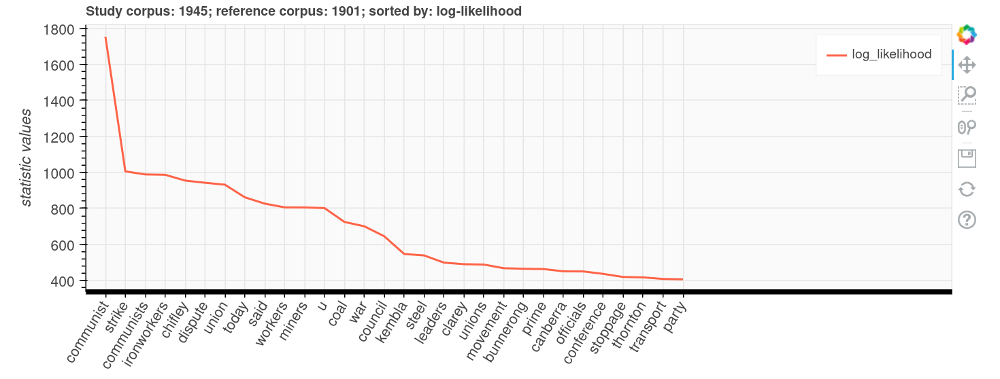

---
jupytext:
  text_representation:
    extension: .md
    format_name: myst
    format_version: 0.13
    jupytext_version: 1.16.1
kernelspec:
  display_name: Python 3 (ipykernel)
  language: python
  name: python3
---

# Tutorials and examples

````{card}
This page includes information on tutorials and examples to help you work with text from Trove.

```{contents}
:local:
:backlinks: None
```
````

+++

## Tutorials

`````{grid}
:gutter: 3

````{grid-item-card} Analysing keywords in Trove's digitised newspapers
:columns: 6



You want to explore differences in language use across a collection of digitised newspaper articles. The [Australian Text Analytics Platform](https://www.atap.edu.au/) provides a [Keywords Analysis tool](https://github.com/Australian-Text-Analytics-Platform/keywords-analysis) that helps you examine whether particular words are over or under-represented across collections of text. But how do get data from Trove's newspapers to the keyword analysis tool?

+++
```{button-link} newspapers-keywords.md
:color: primary
Get started
```
````
`````

## Examples from the GLAM Workbench

[Exploring text files harvested with the Trove Harvester](https://glam-workbench.net/trove-harvester/exploring-troveharvester-text/)
: This notebook suggests some ways in which you can aggregate and analyse the individual OCRd text files for each article — look at word frequencies; calculate TF-IDF values.

[Finding non-English newspapers in Trove](https://glam-workbench.net/trove-newspapers/find-non-english-newspapers/)
: There are a growing number of non-English newspapers digitised in Trove. However, if you're only searching using English keywords, you might never know that they're there. This notebook analyses the language of a sample of articles from each newspaper to create a list of non-English newspapers.

[Counting words and phrases in digitised books](https://glam-workbench.net/trove-books/counting-words-and-phrases/)
: This notebook provides a simple example of extracting word and ngram frequencies from the OCRd text of a digitised book using TextBlob and Wordcloud.

[Recipe generator](https://glam-workbench.net/trove-books/recipe-generator/)
: In this notebook we use TextBlob to extract nouns, verbs, and sentences from the OCRd text of a 19th century cookery book. We try to clean things up a bit, using regular expressions to discard likely OCR errors. Then we recombine the various parts in random combinations to create delicious recipes for all occasions. Enjoy!

## Other examples

- [Topic modelling of Trove Books](https://github.com/adelr/trove-books) (Adel Rahmani)
- [Topic modelling of Australian parliamentary press releases](https://github.com/adelr/trove-refugee) (Adel Rahmani)

```{code-cell} ipython3

```
